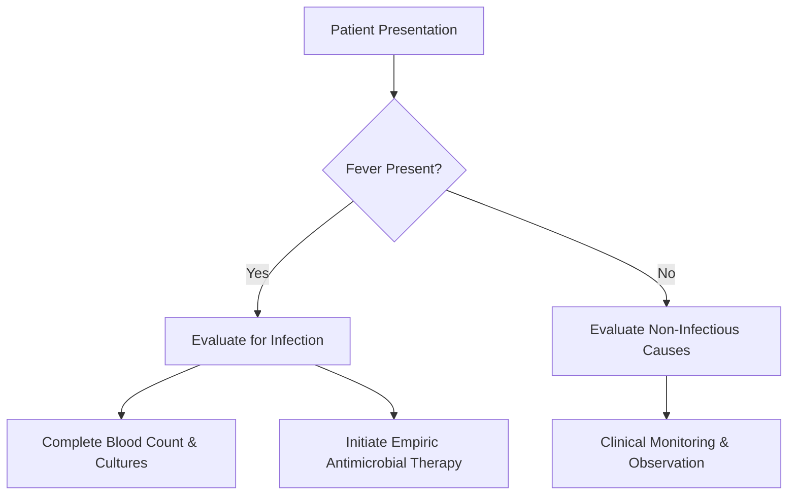
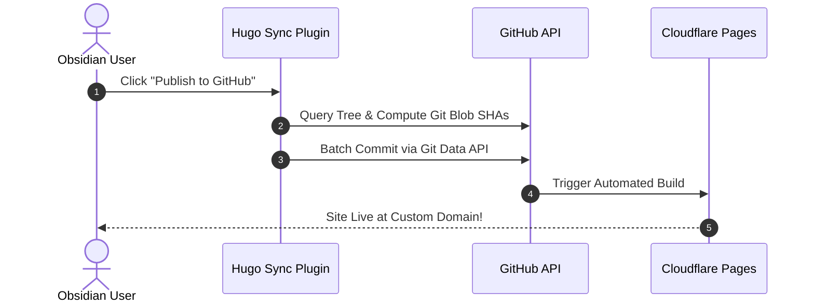

# Feature Showcase & Demo Note

This note showcases the core features built into this Hugo Obsidian template, including mathematical formulas, diagrams, vector icons, custom callout boxes, and responsive 3-pane scrolling.

---

## Obsidian Callouts

All standard Obsidian callout formats work out of the box with matching Lucide vector icons:

> [!tip] Practical Clinical / Study Tip
> Callouts render with beautiful borders and matching background tints.

> [!note] :lucide-sparkles: Custom Lucide Icon in Title
> You can embed any vector Lucide icon directly into callout titles using `:lucide-icon-name:`. The icon automatically inherits the callout''s accent color!

> [!danger] High-Risk / Warning Alert
> Critical warnings and high-priority alerts stand out clearly in red.

> [!example] Diagnostic Criteria Table
> Callouts can nest complex markdown elements like bullet lists and tables.

---

## Mathematical Equations (KaTeX)

You can write standard LaTeX math inline and in display blocks.

### Inline Math
The famous mass-energy equivalence equation is $E = mc^2$, and the normal distribution formula contains $\sigma \sqrt{2\pi}$.

### Display Math Block
$$f(x) = \frac{1}{\sigma \sqrt{2\pi}} e^{-\frac{1}{2}\left(\frac{x-\mu}{\sigma}\right)^2}$$

Complex integrals with summation:

$$\int_{-\infty}^{\infty} e^{-x^2} \, dx = \sqrt{\pi}$$

$$\sum_{n=1}^{\infty} \frac{1}{n^2} = \frac{\pi^2}{6}$$

> [!info] Mobile Responsiveness
> If an equation exceeds the screen width on a mobile device, it smoothly receives an independent horizontal scroll wrapper without breaking the page layout!

---

## Mermaid Diagrams

Flowcharts and diagrams render on demand without slowing down pages that don''t have diagrams:



Sequence diagrams are also supported:



---

## Internal Wikilinks

You can link between notes using standard Obsidian double-bracket wikilinks:
- Return to the [[_index|Home Page]]
- Link to the section index: [[getting-started/_index|Getting Started Index]]

---

## Data Tables & Code Highlighting

| Parameter | Normal Range | Clinical Significance |
| :--- | :--- | :--- |
| **Heart Rate** | 70 – 110 bpm | Varies with age, fever, and perfusion status |
| **Respiratory Rate** | 16 – 24 bpm | Sensitive indicator of pulmonary compromise |
| **Blood Pressure** | 90/60 – 120/80 | Assesses vascular tone and end-organ perfusion |

```javascript
// Example code snippet with syntax highlighting
function calculateAnionGap(sodium, chloride, bicarbonate) {
  return sodium - (chloride + bicarbonate);
}
console.log("Normal gap:", calculateAnionGap(140, 104, 24)); // 12 mEq/L
```